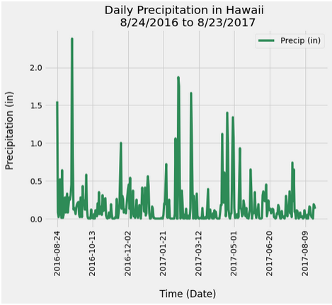

# Surf's Up

## Table of contents
* [Assignment](#assignment)
* [Data Sources](#data_sources)
* [Evaluation](#eval)
* [Conclusions](#conclusions)
* [References](#ref)

## Assignment
Research temperature data in Hawaii to aid in vacation planning.  

## Data Sources and Assumptions
The data was housed in the following sqlite database: hawaii.sqlite

Two (2) csv files were also provided as backup references: 
- hawaii_measurements.csv
- hawaii_stations.csv

Link to data sources: https://github.com/KLacerda08/sqlalchemy-challenge/tree/main/Resources 

## Evaluation
A connection was made to the sqlite database using python in jupyter notebook. The tables within the database were inspected to identify the 
columns in each. Queries were designed to find the following data:  

1. Find last 12 months of precipitation data in the database and visualize the precipitation over time. Prior to plotting, it was necessary to 
	average the precipitation for each day, since multiple measurements were made per day.  The following chart shows the preciptation 
	over time: 

	The results show that the most consistent spans of heavy rain generally occured between February and early March, mid April to early May. 
	However, the highest precipitation occured in September, suggesting a weather event such as a hurricane.    

2. To evaluate precipitation data on a monthly scale, the average precipitation per month was also calculated and visualized:  

	The monthly results suggest that late August to September have the most average rain. However, these monthly averages may be influenced 
	by weather events, such as hurricanes.  Using 0.15 inches per day as an average upper limits, if  a vacation wanted to avoid the rain, 
	the best times to visit Hawaii would be from May to early August, October to November, or in January.  
 
3. Precipitation statistics were also calculated for the most recent year of data.  The average precipitation was 0.17 inches per day, with 
	with a maximum precipitation of 2.38 inches.   

4. The total number of weather stations was identified (9 stations), and the number of measurements at each station was calculated. The most
	frequently measured station was USC00519281, with 2,772 measurements. 

5. Additional statistics were calculated for the most frequently measured station across the entire dataset (USC00519281): 
		Mininum Temperature: 54.0 (deg F)
		Maximum Temperature: 85.0
		Average Temperature: 71.66

6. The most recent 12 months of temperature data from the top measured station (USC00519281) was evaluated and visualized.  

	Based on these data, the climate of Hawaii is generally mild, with most temperature observations falling between approximately 67.5 
	and 81 degrees Fahrenheit.  

7. A weather app was designed to allow the user to query temperature and precipitation data as follows:  

	1.  The most recent 12 months of precipitation data.  
	2.  The list of measurement stations.
	3.  The station ID of the most active station during the latest year of data (USC00519397).  
	4.  The temperature observations from the most recent year at the station that was most actively monitored during the most recent year. 
	5.  The minimum, maximum, and average temperature observations from a user input start date until the most recent date of observations
	    in the data (results vary with user input).  
	6.  The minimum, maximum, and average temperature observations from a user input date range (results vary with user input).   
	7.  An about page was also included to provide the user information on the data background 

## Conclusions

* Based on the daily precipitation data, the most consistent spans of heavy rain generally occured between February and early March, and mid 
	April to early May. However, the highest precipitation occured in September, suggesting a severe weather event such as a hurricane.
* The monthly average precipitation data suggest that late August to September have the most average rain. However, these monthly averages may 
	be influenced by severe weather events, such as hurricanes.  Using 0.15 inches per day as an average upper limit, if a vacationer 
	wanted to avoid rainy weather, the best times to visit Hawaii would be from May to early August, October to November, or in January.   
* Based on the temperature data, the climate of Hawaii is generally mild, with most temperature observations falling between approximately 
	67.5 nd 81 degrees Fahrenheit.  

## References
1. image source: https://www.surfertoday.com/surfing/what-is-the-hawaiian-wave-scale